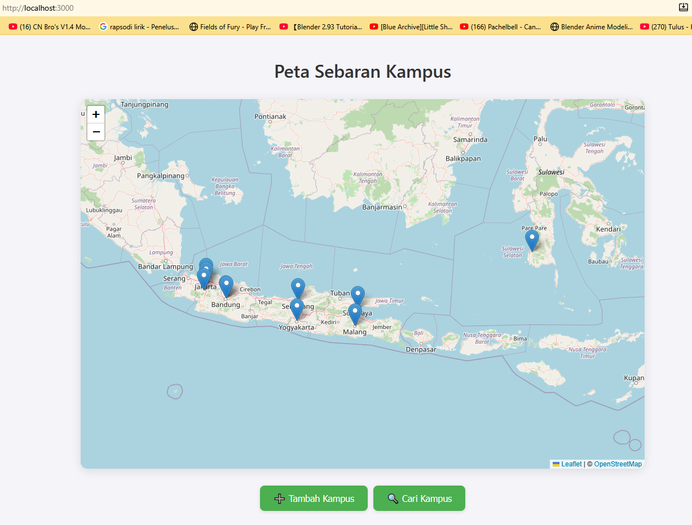
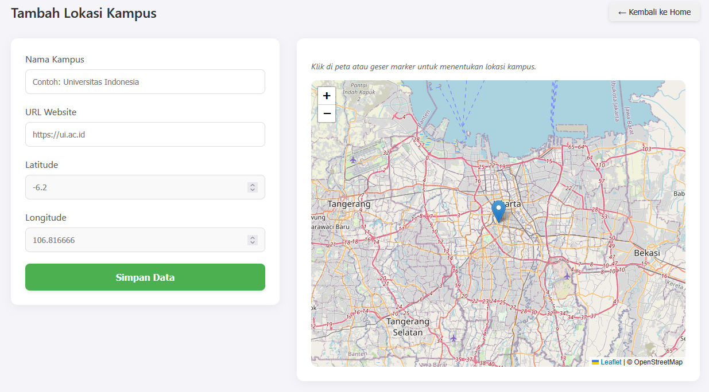
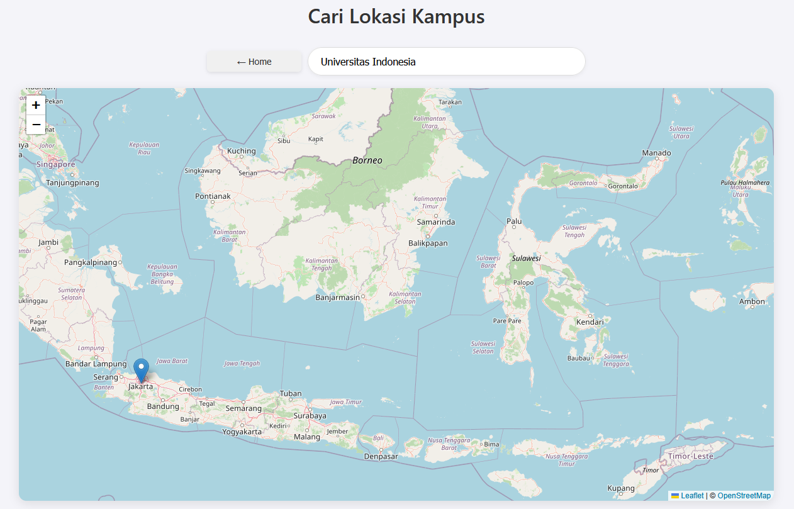
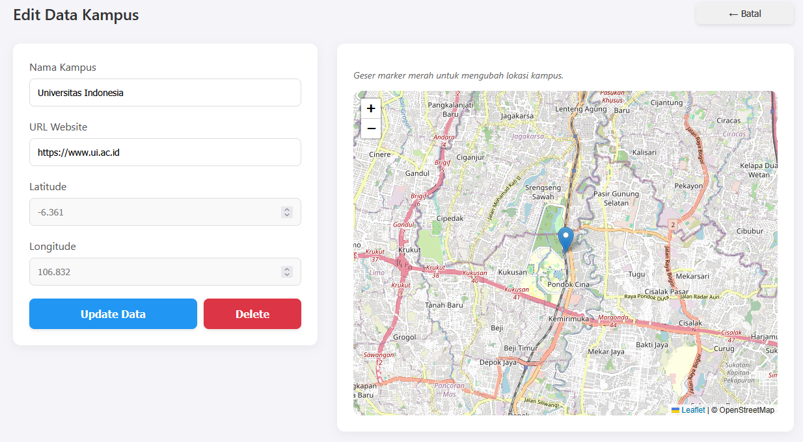

# 📍 Interactive Campus Map

**Interactive Campus Map** adalah aplikasi pemetaan kampus berbasis web yang menampilkan lokasi kampus di seluruh Indonesia menggunakan **Leaflet.js**. Aplikasi ini dilengkapi fitur **CRUD** (Create, Read, Update, Delete) untuk pengelolaan data kampus secara dinamis.

Proyek ini dibangun untuk memenuhi tugas akhir **Praktikum Pemrograman Web**.

## 👥 Anggota Kelompok

| Nama | NIM |
| :--- | :--- |
| **Raihan Ahmad Fathoni** | 51423206 |
| **Muhammad Rizqy Pangeran Winarko** | 51423012 |
| **Muhammad Martaji Samodra** | 50423960 |

---

## 📘 Deskripsi Project

Project ini menampilkan peta interaktif yang memudahkan pengguna untuk mencari dan mengelola informasi lokasi kampus.

**Fitur Utama:**
* 🌍 **Peta Interaktif:** Melihat persebaran kampus pada peta digital.
* 🔗 **Akses Website:** Mengunjungi website resmi kampus langsung melalui popup marker.
* 🔍 **Pencarian:** Mencari kampus spesifik berdasarkan nama.
* ➕ **Tambah Data:** Menambahkan marker kampus baru ke dalam database.
* ✏️ **Edit Data:** Mengubah informasi kampus (nama, koordinat, website).
* 🗑️ **Hapus Data:** Menghapus data kampus yang sudah tidak diperlukan.
* 📍 **Drag & Drop:** Memindahkan posisi marker secara manual pada peta saat mode edit.

---

## 🏛 Arsitektur & Teknologi

Aplikasi ini menggunakan arsitektur **Client-Server** dengan rincian sebagai berikut:

* **Frontend (Client Side)**
    * Menggunakan **React.js** untuk antarmuka pengguna.
    * Menggunakan **Leaflet.js** untuk rendering peta interaktif.
    * Berkomunikasi dengan Backend menggunakan **Fetch API**.
* **Backend (Server Side)**
    * Dijalankan menggunakan **Node.js** dan framework **Express.js**.
    * Menyediakan **REST API** (GET, POST, PUT, DELETE).
    * Bertugas melayani (_serve_) build frontend statis.
* **Database**
    * Menggunakan **MySQL**.
    * Menyimpan data pada tabel utama: `daftar_kampus_1`.

---

## 🎯 Tujuan Project

Aplikasi ini dibuat untuk mempermudah pengguna dalam:
1.  Melihat lokasi kampus secara visual dan akurat.
2.  Mengelola database lokasi kampus dengan antarmuka yang mudah (GUI).
3.  Menemukan kampus tertentu dengan cepat melalui fitur pencarian.
4.  Mengakses portal informasi kampus (website resmi) secara instan.

---

## 🚀 Cara Menjalankan Project

Ikuti langkah-langkah berikut untuk menjalankan aplikasi di komputer lokal:

### 1️⃣ Clone Repository
git clone https://github.com/Raintxhanx/Interactive-Campus-Map.git

### 2️⃣ Masuk ke Folder Backend
cd backend

### 3️⃣ Install Dependency
npm install

### 4️⃣ Konfigurasi Database

    Buat database baru di MySQL (misalnya: kampus_db).

    Import file .sql yang ada di folder project ke dalam database tersebut.

    Pastikan tabel daftar_kampus_1 sudah terbentuk.

### 5️⃣ Atur Environment Variable (.env)
Buat file baru bernama .env (atau rename .env.example), lalu isi konfigurasinya sesuai dengan database Anda (pastikan port aplikasi di 3000)

### 6️⃣ Jalankan Server
node server.js

Aplikasi sekarang dapat diakses melalui browser di: 👉 http://localhost:3000

## 🖼️ Tampilan Program

Berikut adalah tampilan antarmuka dari aplikasi Interactive Campus Map:

### 🏠 Halaman Utama
Menampilkan peta sebaran kampus.

### ➕ Tambah Kampus
Formulir untuk menambahkan data kampus baru.

### 🔍 Cari Kampus
Fitur pencarian lokasi kampus berdasarkan nama.

### ✏️ Edit Kampus
Mode edit untuk mengubah data atau posisi marker.

